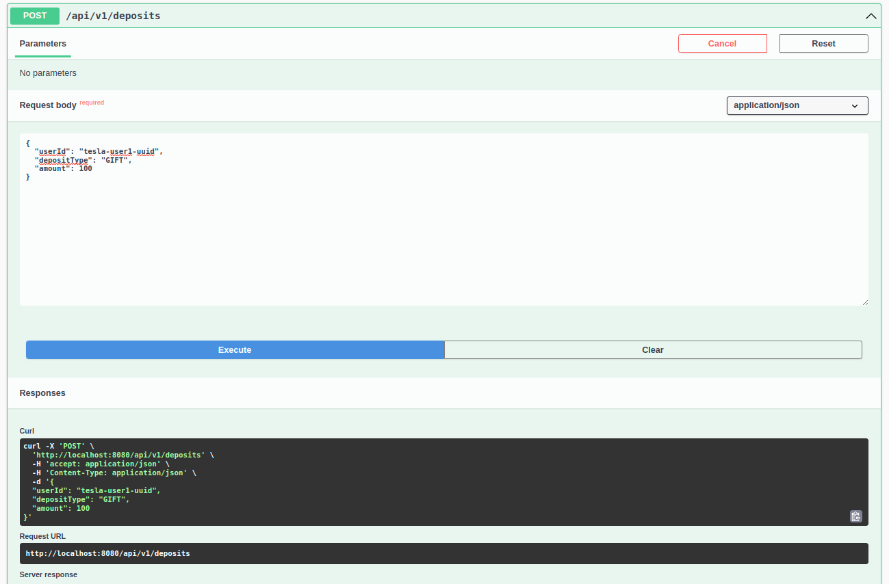
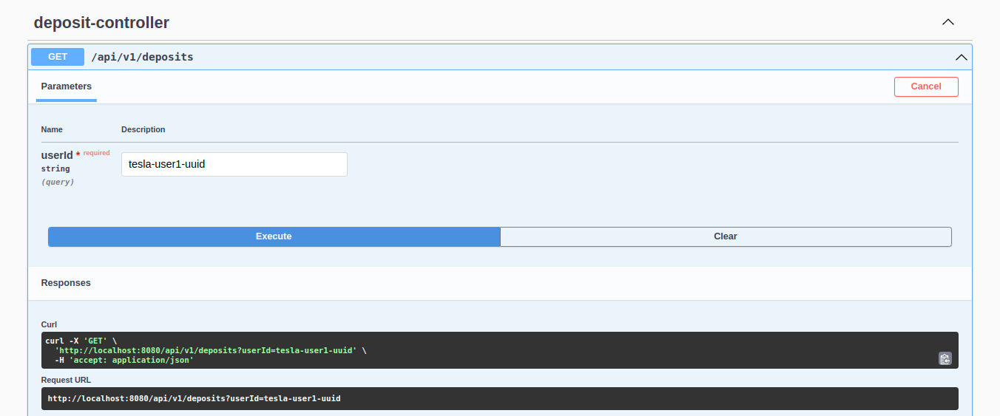

## Customer

There are 2 customers known by the application: tesla and apple.  
A Basic auth mechanism is set up to authenticate api users:

- Tesla: tesla-uuid/tesla-password
- Apple: apple-uuid/apple-password

## User

There are 4 users known by the application:

- apple-user1-uuid belongs to apple-uuid company
- apple-user2-uuid belongs to apple-uuid company
- tesla-user1-uuid belongs to tesla-uuid company
- tesla-user2-uuid belongs to tesla-uuid company

## Balance

When starting the application:

- Tesla has a balance of 1000€
- Apple has a balance of 2000€.

## Application

Note that the application (deposit-service) is focused **ONLY** on **Deposit**.  
It's not focused on other domain model such as Customer, User or Balance.  
When starting the application, an in-memory H2 database is created (see schema.sql) and populated (see data.sql)  
Database is owned by deposit-service and consequently contains only tables related to Deposit. (We try to stick to DDD)

## OpenAPI & Swagger UI

The OpenApi standard was used to describe the REST API.  
Additionally, a self-configured UI is available at: http://localhost:8080/swagger-ui/index.html   
Note : you will need to use the basic auth credentials to authenticate. (see above)

## Test

Some unit and integration tests are available on test/java folder.

## Exercice

- Implement one or two functions allowing companies to distribute gift and meal deposits to a user if the company
  balance allows it.
    - On swagger ui, please use POST api/v1/deposits
    - 
- Implement a function to calculate the user's balance.
    - Please use GET api/v1/deposits?userId=...
    - Then api client must map + reduce the deposit list to get the current balance
    - Example in DepositServiceApplicationTests.shouldAddMultipleDeposits()
    - // 6/ Calculate the tesla-user1-uuid balance
    - 
